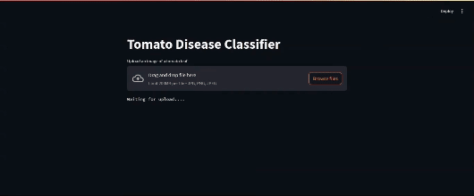

## Description

This project is a system for classifying tomato leaf images to detect diseases at an early stage. The application informs the farmer about the disease and the measures to be taken.



## Install Dependencies

Run:
```bash
pip install -r requirements.txt
```

## Start App

Just run:
```bash
streamlit run app.py
```

Then, you can see your app at the url `http://localhost:8501`.
